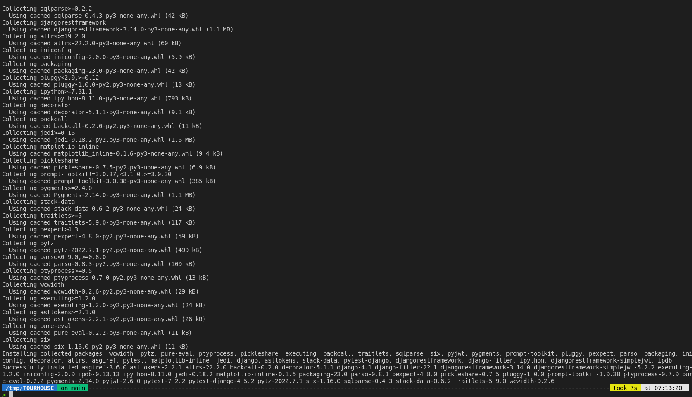
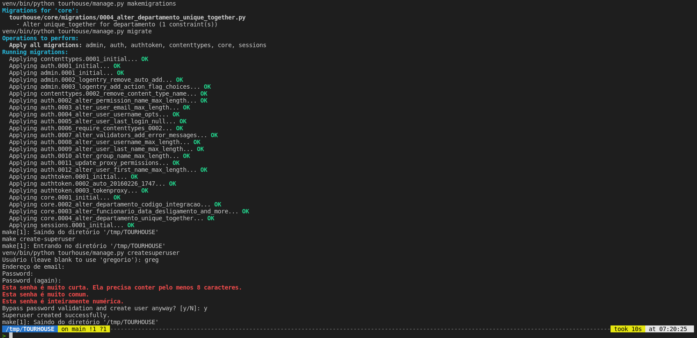
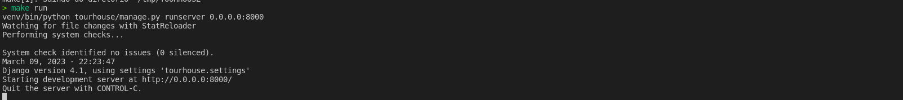

# Praticando conceitos de *Django Framework com Python 3.11*.
___
## Requisito para rodar o projeto:
    Python 3.11
    Python-env

___
## Como executar o projeto:
#### Com os requisitos cumpridos façar no seu terminal unix:
```python
make create-venv
make install-requirements
make restart-db
```
#### A saida deve ser:

#### E mais...



#### Rodando o projeto:
```python
make run
```

#### A saida deve ser:


___
#### Agora estamos pronto...

#### Autorização
___
#### Foi adicionado autorização com token em todas as rotas como */token*. 

```python
POST {{server_base}}/token/
Content-Type: application/json

{
    "username": "greg",
    "password": "123"
}
```
#### _Detalhes:_ O campo *username* e *password* são informações de login que criou no comando de *createsuperuser*.

#### Antes de mais nada existe um arquivo de testes dentro de __tourhouse/playground__ chamado *test.http*. Ele é os verbos de __GET POST PUT e DELETE__ para todas entidades desse projeto. Mas ainda sim vamos comentar algumas coisas.
[test.http](https://github.com/greghonox/tourhouse/blob/main/playground/test.http)

#### O test.http é usado junto com __vs code__ assim consegue ter um cliente __rest__ no ambiente de desenvolvimento. Veja abaixo o icone da extenção

___
## Verificando o desafio:


___
#### 