# Desafio com *Django Framework com Python 3.11*.
___
## Requisito para rodar o projeto:
    Python 3.11
    Python-env

___
## Como executar o projeto:
#### Com os requisitos cumpridos façar no seu terminal unix:
```python
make create-venv
make install-requirements
make restart-db
```
#### A saida deve ser:

#### E mais...


#### Rodando o projeto:
```python
make run
```

#### A saida deve ser:


___
#### Agora estamos pronto...

#### Requisitando o Token
___
#### Foi adicionado bloqueio com token em todas as rotas como */token*. Para pegar um token valido basta solicitar conforme exemplo abaixo:

```python
POST http://localhost:8000/token/
Content-Type: application/json

{
    "username": "greg",
    "password": "123"
}
```
#### _Detalhes:_ O campo *username* e *password* são informações de login que criou no comando de *createsuperuser*.

#### Antes de mais nada existe um arquivo de testes dentro de __tourhouse/playground__ chamado *test.http*. Ele é os verbos de __GET POST PUT e DELETE__ para todas entidades desse projeto. Mas ainda sim vamos comentar algumas coisas.
[test.http](playground/test.http)

#### Você pode utilizar o programa da sua preferencia para solicitar a api. Usamos  __Rest Client__ do proprio __vs code__. Veja abaixo o icone da extenção
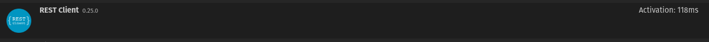

#### Visualizando alguns testes conforme a imagem abaixo, pode se notar todas solicitações possiveis, iremos comentar também aqui nesse Readme.md algumas delas.
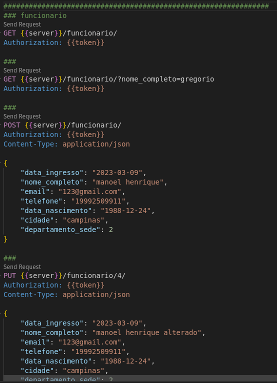

## Verificando o desafio:
___
[link.desafio](tourhouse/docs/Avalia%C3%A7%C3%A3o%20T%C3%A9cnica%20BackEnd.pdf)

#### Testes Unitários
___
##### Para executar os testes unitários:
```python
make tests
```
#### A saida deve ser:
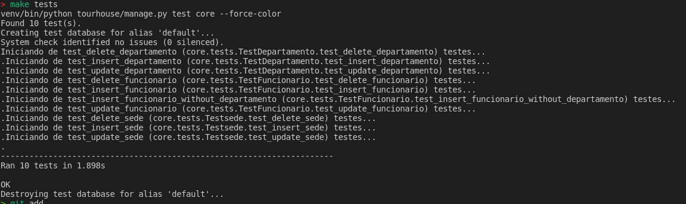

### O codigo dos testes unitários:
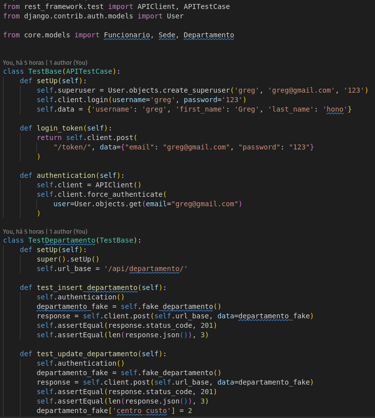
[codigo](tourhouse/core/tests.py)

### Rotas e seus retornos
___
### __Observações:__
#### Sempre que ver *{{server}}* é o mesmo que __http://localhost:8000__

#### Funcionario
##### Criacao __POST__
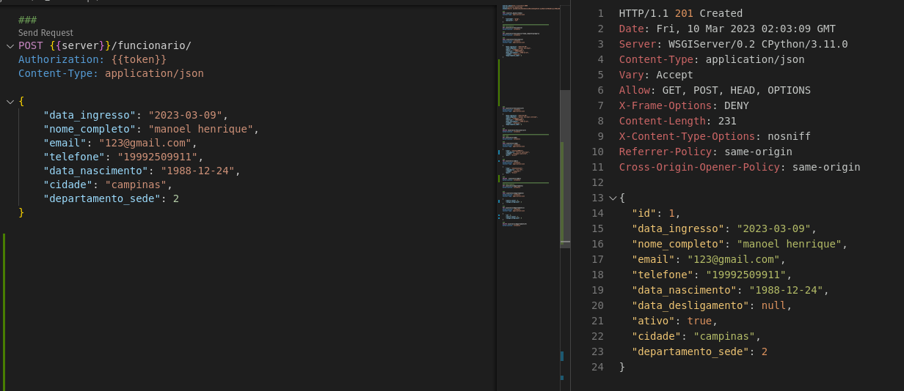
##### Verificação de tentativa de cadastro de com *e-mail do funcionario repetido*
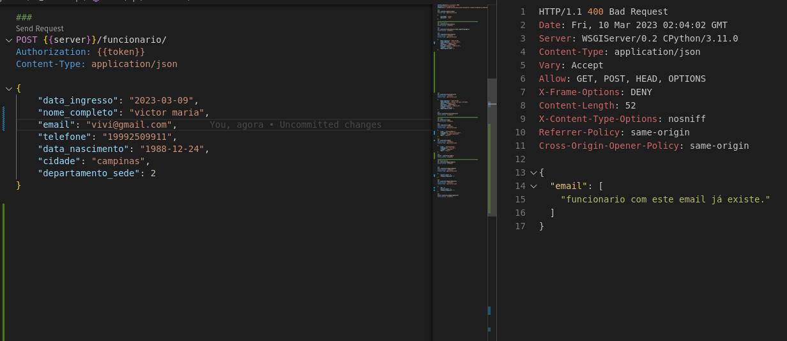
##### Listagem __GET__
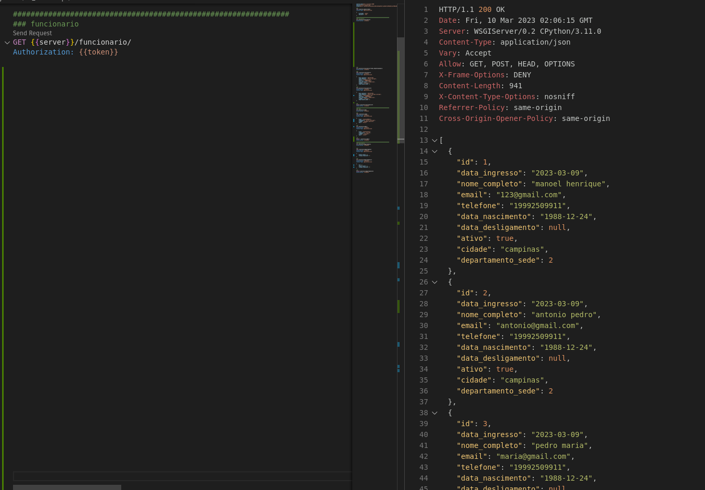

##### Pode se aplicar filtros para encontrar o que deseja
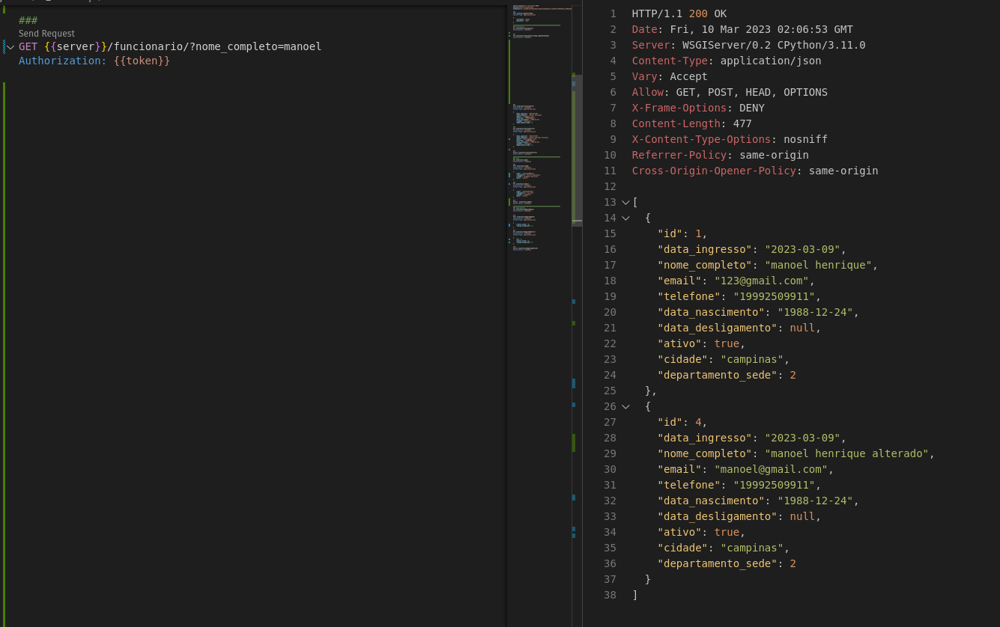
##### Alguns campos de filtros:
    * nome_completo
    * email
    * telefone
    * data_nascimento
    * data_ingresso
    * data_desligamento
    * ativo
    * cidade
    * departamento_sede

##### Alterar __PUT__
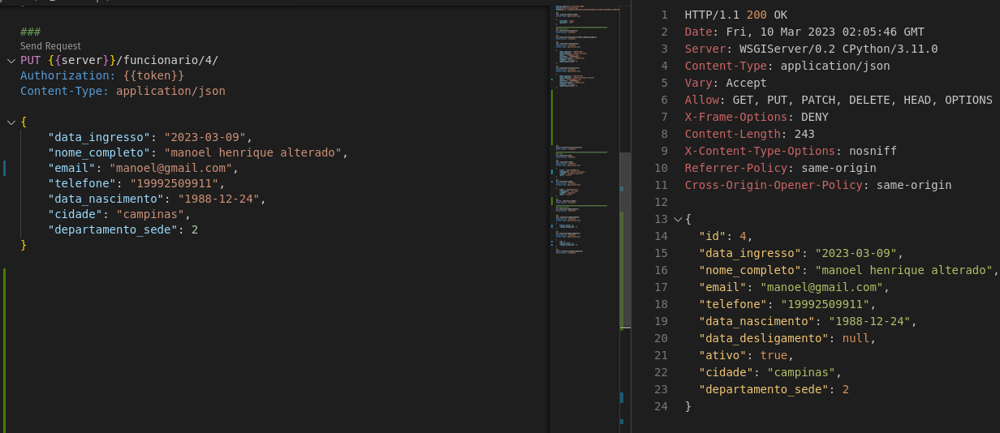
##### Delete __PUT__
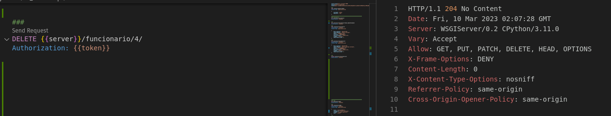
#### Sede
##### Criacao __POST__
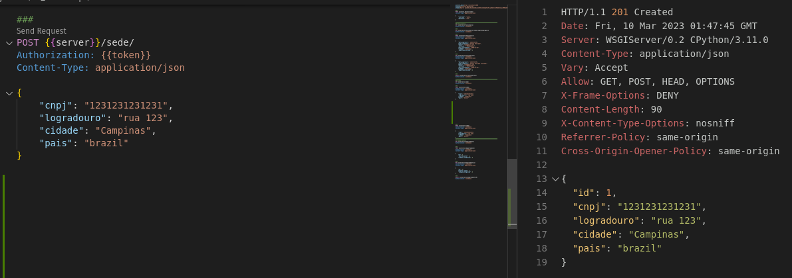
##### Listagem __GET__
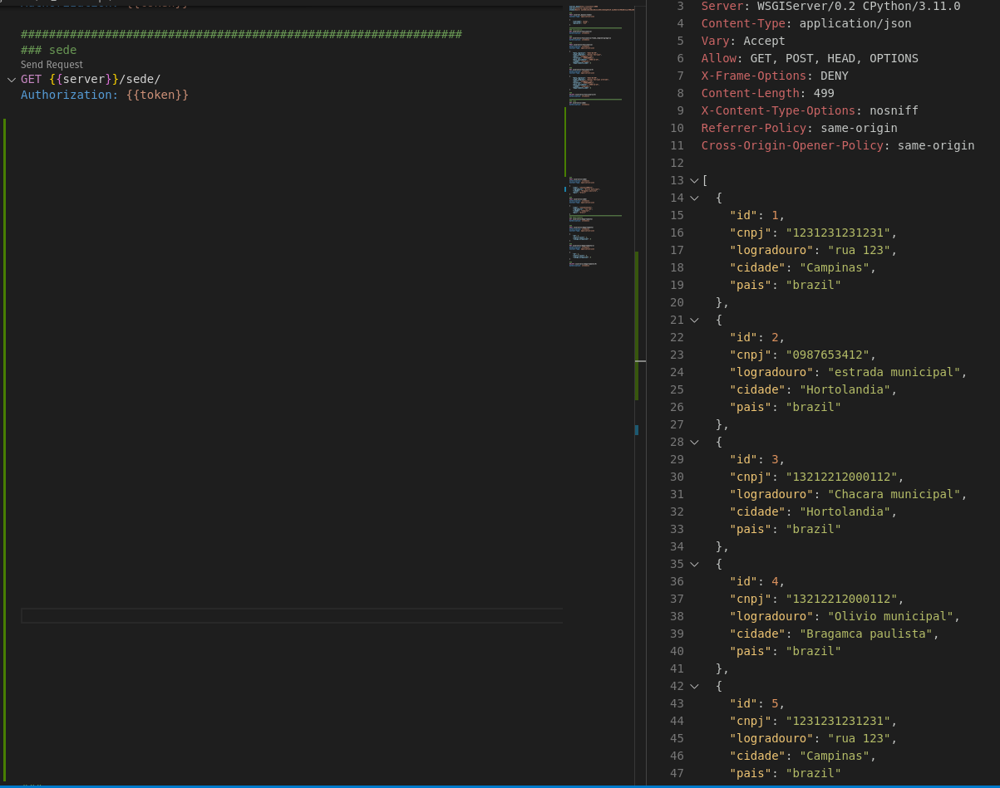
##### Alguns campos de filtros:
    * cnpj
    * logradouro
    * cidade
    * pais

##### Alterar __PUT__
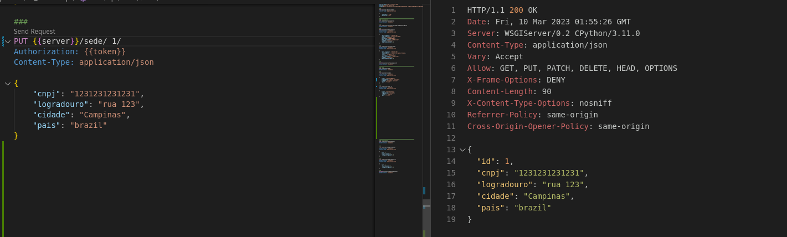
##### Delete __PUT__
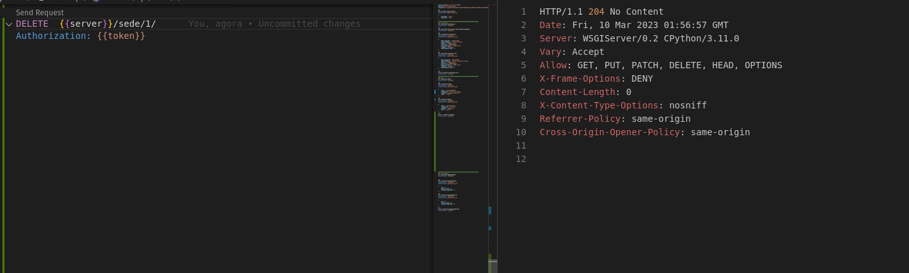

#### Departamento
##### Criacao __POST__
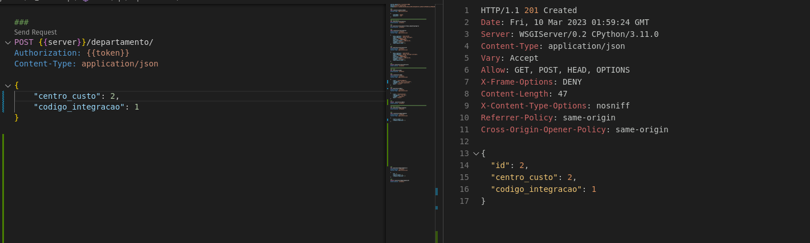
##### Verificação de tentativa de cadastro de *departamento repetido*
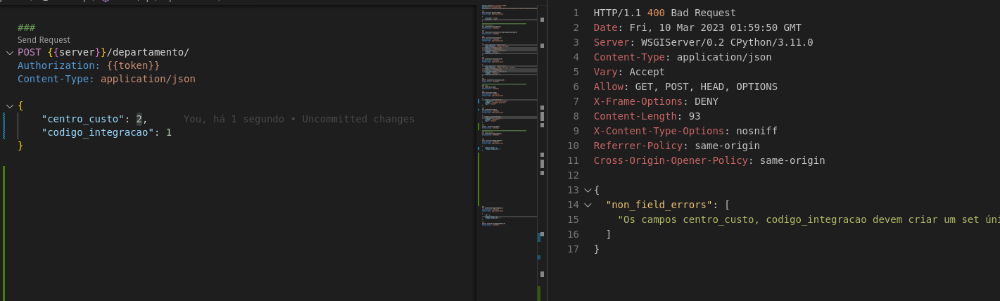
##### Listagem __GET__
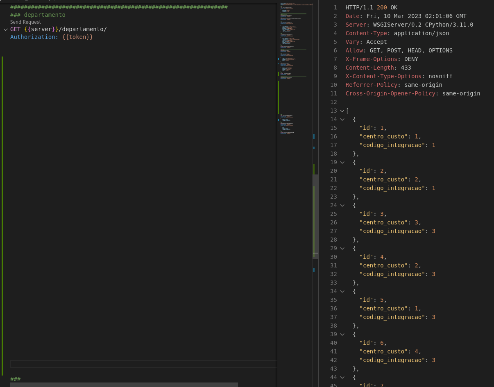
##### Alguns campos de filtros:
    * centro_custo
    * codigo_integracao
##### Alterar __PUT__
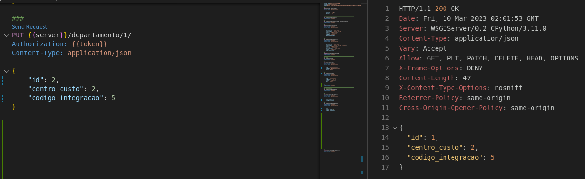
##### Delete __PUT__
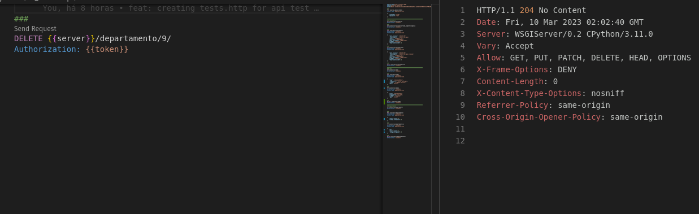

### Historio de desenvolvimento
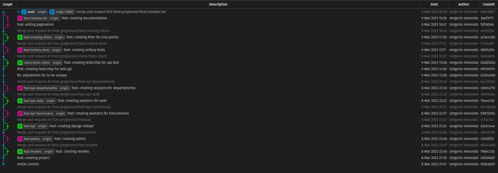